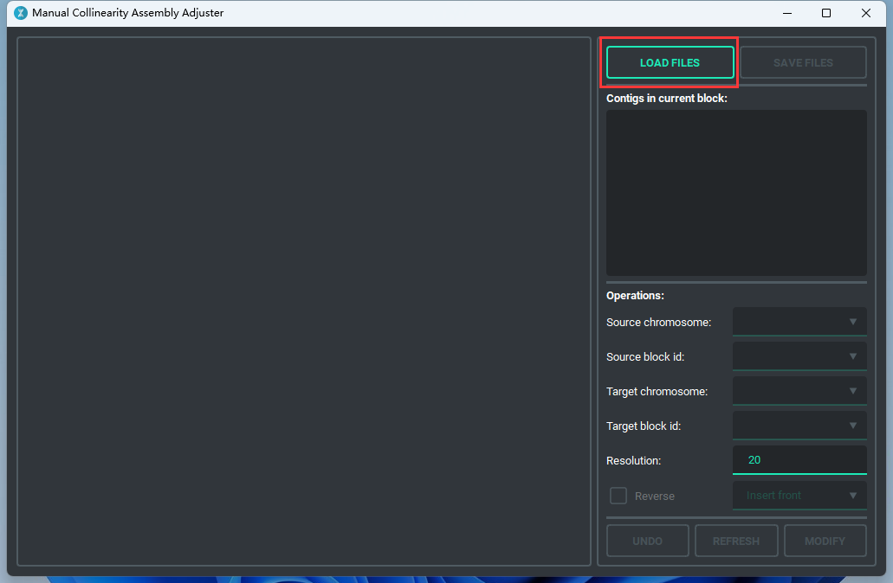
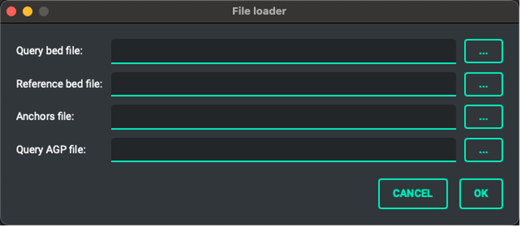
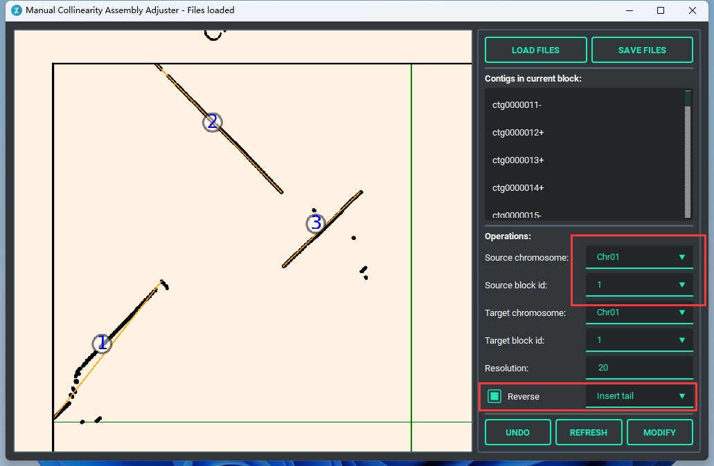
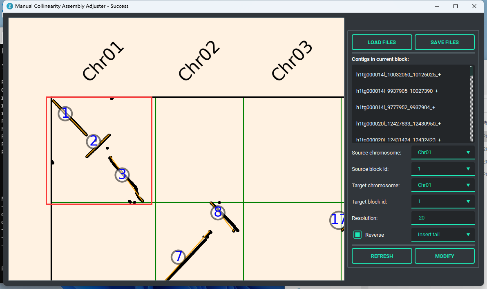
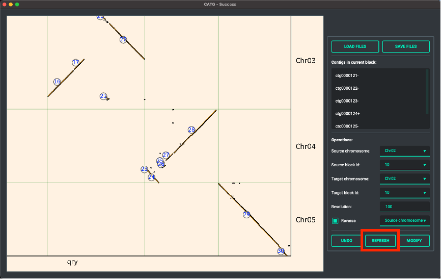
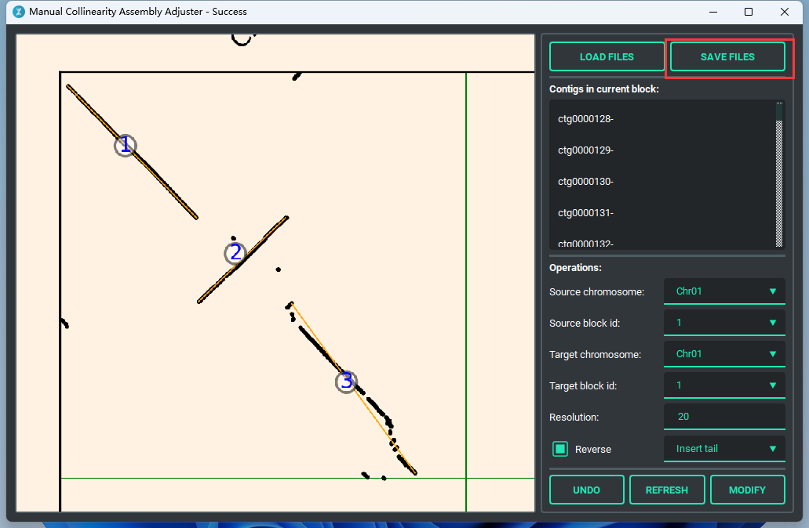
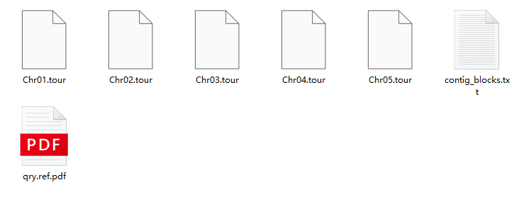

## Introduction
CATG (**C**ollinearity-based **A**ssembly correc**T**or **G**UI) is a GUI application base on Qt with PySide6. 
It is a tool that can adjust assembly with collinearity and generate tour files for assembly.

## Dependencies

### Software
* [jcvi](https://github.com/tanghaibao/jcvi)
* [ALLHiC](https://github.com/tangerzhang/ALLHiC)
* Python 3.7+

### Python Modules
* PySide6
* qt-material
* matplotlib

## Installation
Download executable file from release.

## Data preparation
Run jcvi for generating anchors file
```bash
python -m jcvi.compara.catalog ortholog query.bed reference.bed
```
The query.bed, reference.bed, query.reference.anchors, query.agp are all files we need.

## Operations

### Importance

Once "MODIFY" is clicked, please waiting until the title bar show "Success" before next click.

### Main operations
There are 6 type of operations can be done.

1. **Insert front**  
   Move block with source block id from source chromosome to target chromosome and insert it in front of target block.
2. **Insert back**  
   Move block with source block id from source chromosome to target chromosome and insert it after target block.
3. **Insert head**  
   Move block with source block id from source chromosome to target chromosome and insert it to the head of target chromosome.
4. **Insert tail**  
   Move block with source block id from source chromosome to target chromosome and insert it to the tail of target chromosome.  
   _Operate 1-4 can work with Reverse checkbox, if Reverse checkbox is set checked, the block from source chromosome will be reverse complement before insert to target positiong._
5. **Source chromosome**
6. **Source block**  
   These two operate only affect while Reverse checkbox is set checked, then it will reverse the source chromosome or source block.
7. **Swap chromosome**
8. **Swap block**  
   These two operate can swap regions or chromosomes, and Reverse option won't affect.
9. **Delete block**  
   Delete block from source chromosome.
### Others
You can resize the collinearity figure with wheel, and use mouse to drag it.

## Example

### Step1. Open MCAAG and click "LOADFILES"


### Step2. Select files


### Step3. Set Operations

The red rectangles above means move Block 1 in Chromosome 1 to the tail of Chromosome 1, and convert Block1 to its reverse complement. 

### Step4. Modify
After click "MODIFY" button, the new collinearity figure will be updated, it may take several seconds, please be patient.


### Step5. Refresh
If you want cluster less contigs in single block, increase Resolution value may help you.
After that, click "REFRESH" button to update collinearity figure.


### Step6. Save
Click "SAVE FILES" to save the adjusted tour files, after that ALLHiC_build can use for building new chromosome assembly from contig level assembly, or use allhic optimize to determine the order and orientation of contigs.


