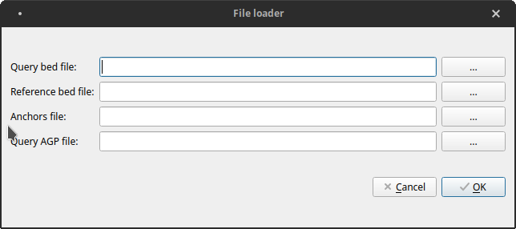
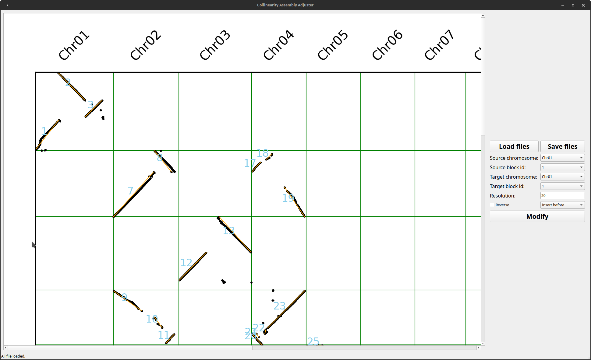
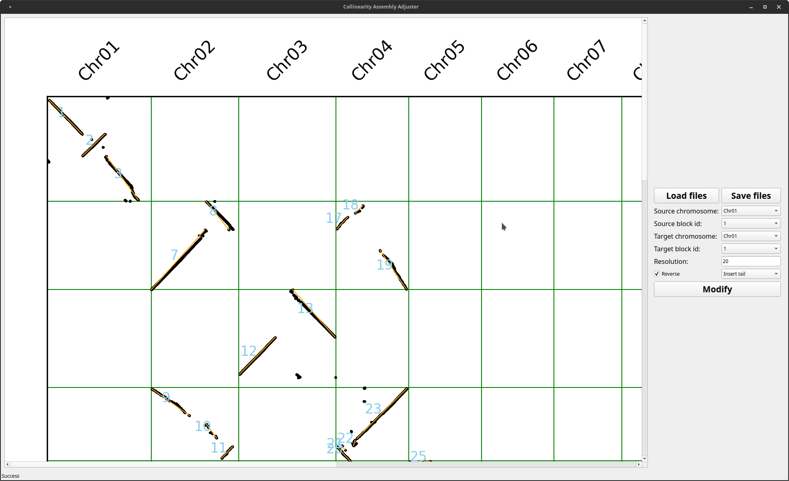

## Introduction
MCAAG (Manual Collinearity Assembly Adjuster GUI) is a GUI application base on Qt 5 with PySide2. 
It is a tool that can adjust assembly with collinearity and generate tour files for assembly.

## Dependencies

### Software
* [jcvi](https://github.com/tanghaibao/jcvi)
* [ALLHiC](https://github.com/tangerzhang/ALLHiC)
* Python 3.7+

## Python Modules
* PySide2
* qt-material
* matplotlib

## Installation
```bash
git clone https://github.com/sc-zhang/MCAAG.git
cd /path/to/install/MCAAG
python3 MCAAG.py
```

## Usage
Run jcvi for generating anchors file
```bash
python -m jcvi.compara.catalog ortholog query.bed reference.bed
```
The query.bed, reference.bed, query.reference.anchors, query.agp are all files we need.

### Step 1. Open main form


Click "Load files" button
### Step 2. Load files


Select all 4 required files.

### Step 3. Adjust assembly manually

There are 6 type of operate can be done.

1. **Insert front**  
   Move block with source block id from source chromosome to target chromosome and insert it in front of target block.
2. **Insert back**  
   Move block with source block id from source chromosome to target chromosome and insert it after target block.
3. **Insert head**  
   Move block with source block id from source chromosome to target chromosome and insert it to the head of target chromosome.
4. **Insert tail**  
   Move block with source block id from source chromosome to target chromosome and insert it to the tail of target chromosome.  
   _Operate 1-4 can work with Reverse checkbox, if Reverse checkbox is set checked, the block from source chromosome will be reverse complement before insert to target positiong._
5. **Source chromosome**
6. **Source block**  
   These two operate only affect while Reverse checkbox is set checked, then it will reverse the source chromosome or source block.
7. **Swap chromosome**
8. **Swap block**  
   These two operate can swap regions or chromosomes, and Reverse option won't affect.


For example:


We can move block 1 to the end of Chr01 with reverse complement.


## Generate executable file
If you want executable file, please use pyinstaller, and run commands below
```bash
pip install pyinstaller
# For unix-like system
pyinstaller --noconsole MCAAG.py -i "coll_asm_adj_gui/icons/MCAAG.ico" --hidden-import PySide2.QtXml --add-data "coll_asm_adj_gui/icons/MCAAG.png:coll_asm_adj_gui/icons/MCAAG.png" -F -w
# For windows
pyinstaller --noconsole MCAAG.py -i "coll_asm_adj_gui/icons/MCAAG.ico" --hidden-import PySide2.QtXml --add-data "coll_asm_adj_gui/icons/MCAAG.png;coll_asm_adj_gui/icons/MCAAG.png" -F -w
```
You can also use nuitka to do samething, the parameters may need modified for building.
```bash
pip install nuitka
pip install zstandard # for compress
# For unix-like system
nuitka --standalone --windows-disable-console --show-memory --show-progress --plugin-enable=pyside2,numpy --follow-import-to=need --include-data-dir="coll_asm_adj_gui/icons/MCAAG.png"="coll_asm_adj_gui/icons/MCAAG.pngi" --include-package-data="qt_material" --windows-icon-from-ico="coll_asm_adj_gui/ui/MCAAG.ico" --onefile MCAAG.py
# For windows
nuitka --standalone --windows-disable-console --mingw64 --show-memory --show-progress --plugin-enable=pyside2,numpy --follow-import-to=need --include-data-dir="coll_asm_adj_gui/icons/MCAAG.png"="coll_asm_adj_gui/icons/MCAAG.png" --include-package-data="qt_material" --windows-icon-from-ico="coll_asm_adj_gui/ui/MCAAG.ico" --onefile MCAAG.py
```
After all done, copy MCAAG in dist folder to anywhere with same platform to use it.
