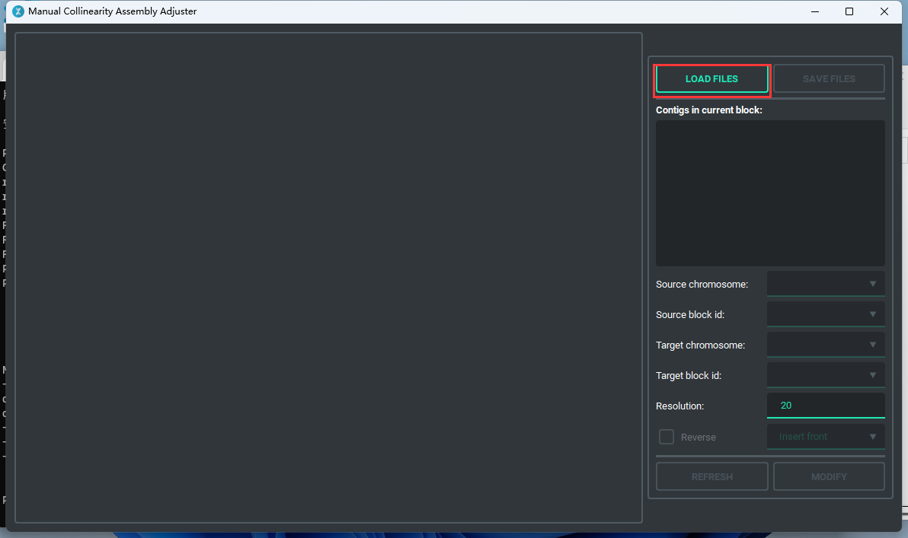
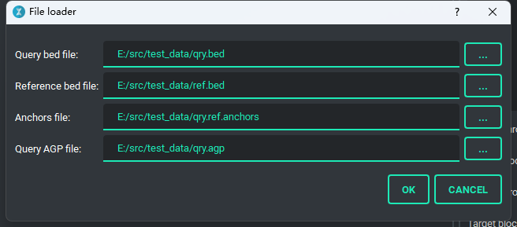

## Introduction
MCAAG (Manual Collinearity Assembly Adjuster GUI) is a GUI application base on Qt 5 with PySide2. 
It is a tool that can adjust assembly with collinearity and generate tour files for assembly.

## Dependencies

### Software
* [jcvi](https://github.com/tanghaibao/jcvi)
* [ALLHiC](https://github.com/tangerzhang/ALLHiC)
* Python 3.7+

## Python Modules
* PySide2
* qt-material
* matplotlib

## Installation
```bash
git clone https://github.com/sc-zhang/MCAAG.git
cd /path/to/install/MCAAG
python3 MCAAG.py
```

## Data preparation
Run jcvi for generating anchors file
```bash
python -m jcvi.compara.catalog ortholog query.bed reference.bed
```
The query.bed, reference.bed, query.reference.anchors, query.agp are all files we need.

## Operations

### Main operations
There are 6 type of operations can be done.

1. **Insert front**  
   Move block with source block id from source chromosome to target chromosome and insert it in front of target block.
2. **Insert back**  
   Move block with source block id from source chromosome to target chromosome and insert it after target block.
3. **Insert head**  
   Move block with source block id from source chromosome to target chromosome and insert it to the head of target chromosome.
4. **Insert tail**  
   Move block with source block id from source chromosome to target chromosome and insert it to the tail of target chromosome.  
   _Operate 1-4 can work with Reverse checkbox, if Reverse checkbox is set checked, the block from source chromosome will be reverse complement before insert to target positiong._
5. **Source chromosome**
6. **Source block**  
   These two operate only affect while Reverse checkbox is set checked, then it will reverse the source chromosome or source block.
7. **Swap chromosome**
8. **Swap block**  
   These two operate can swap regions or chromosomes, and Reverse option won't affect.

### Otherwise
You can resize the collinearity figure with wheel, and use mouse to drag it.

## Example

### Step1. Open MCAAG and click "LOADFILES"


### Step2. Select files


### Step3. Set Operations

The red rectangles above means move Block 1 in Chromosome 1 to the tail of Chromosome 1, and convert Block1 to its reverse complement. 

### Step4. Modify
After click "MODIFY" button, the new collinearity figure will be updated, it may take several seconds, please be patient.


### Step5. Refresh
If you want clust less contigs in single block, increase Resolution value may help you.
After that, click "REFRESH" button to update collinearity figure.


## Generate executable file
If you want executable file, please use pyinstaller, and run commands below
```bash
pip install pyinstaller
# For unix-like system
pyinstaller --noconsole MCAAG.py -i "coll_asm_adj_gui/resources/MCAAG.ico" --hidden-import PySide2.QtXml --add-data "coll_asm_adj_gui/resources/MCAAG.png:coll_asm_adj_gui/resources/" -F -w
# For windows
pyinstaller --noconsole MCAAG.py -i "coll_asm_adj_gui/resources/MCAAG.ico" --hidden-import PySide2.QtXml --add-data "coll_asm_adj_gui/resources/MCAAG.png;coll_asm_adj_gui/resources/" -F -w
```
You can also use nuitka to do samething, the parameters may need modified for building.
```bash
pip install nuitka
pip install zstandard # for compress
# For unix-like system
python -m nuitka --standalone --windows-disable-console --show-memory --show-progress --nofollow-imports --plugin-enable=pyside2,numpy --follow-import-to=matplotlib,qt_material --include-data-files="coll_asm_adj_gui/resources/MCAAG.png"="coll_asm_adj_gui/resources/MCAAG.png" --include-package-data="qt_material" --windows-icon-from-ico="coll_asm_adj_gui/resources/MCAAG.ico" --onefile MCAAG.py
# For windows
python -m nuitka --standalone --windows-disable-console --mingw64 --show-memory --show-progress --nofollow-imports --plugin-enable=pyside2,numpy --follow-import-to=matplotlib,qt_material --include-data-files="coll_asm_adj_gui/resources/MCAAG.png"="coll_asm_adj_gui/resources/MCAAG.png" --include-package-data="qt_material" --windows-icon-from-ico="coll_asm_adj_gui/resources/MCAAG.ico" --onefile MCAAG.py
```

### Environments have been tested for packing executable file
Sometimes the executable file packed by nuitka may not work, the packages combination list below has been tested, may help build your own executable file.
```bash
Python==3.8.10
PyInstaller==5.4.1
Nuitka==1.1.2
numpy==1.19.5
matplotlib==3.4.3
PySide2==5.15.2.1
qt-material==2.12
zstandard==0.18.0
```
```bash
Python==3.10.8
PyInstaller==5.5
Nuitka==1.1.4
numpy==1.23.4
matplotlib==3.5.1
PySide2==5.15.2.1
qt-material==2.12
zstandard==0.18.0
```